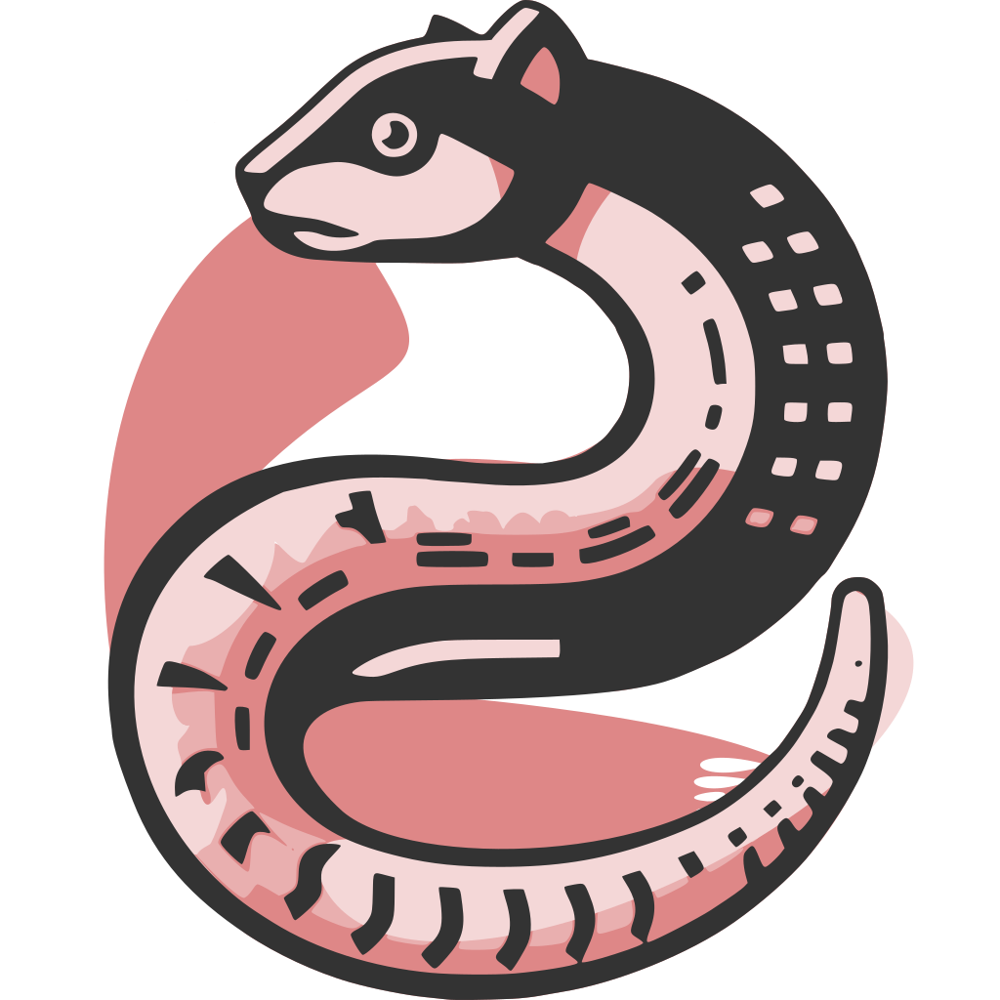

# NumbatUI: source code and graph explorer

:warning: This fork of Sourcetrail is in active development and really unstable, we recommend to not use it before our first releases.



Numbat UI is a fork of [Sourcetrail](https://github.com/CoatiSoftware/Sourcetrail), a source code explorer that was archived in 2021. 

**Why NumbatUI?**
NumbatUI has been written to explore any graph-based data generated by [Numbat](https://quarkslab.github.io/numbat/) (which enables crafting databases through a friendly Python API).
More specifically, NumbatUI has been created to extend Sourcetrail for additional UI/UX features.
Features added are:

* Renaming nodes and edges (to reflect the user specific use-case)
* Custom colors on nodes or edges
* Custom node or edges (tooltips, hovering text)
* file sideloading  (to store file content outside of the database)
* bookmarking all predecsessors or successors of a given node (for later analysis)
* **custom commands** (to perform any user-defined action on nodes/edges, e.g., open a terminal at a given path, open a web page, etc.)

## Usage

We strongly recommend using the provided Docker image to run NumbatUI, as
it contains all the required dependencies. You can either:
- Build locally the docker image:
  ```bash
  cd docker
  docker build -t numbatui .
  ```
- Download it from github:
  ```bash
  docker pull ghcr.io/quarkslab/numbatui:main
  ```

Then open the */path/to/my_database.srctrlprj* database with NumbatUI. The command will depend of your windowing system, as the application is a GUI Qt application
one needs to forward the X11/Wayland display to the container.


- For **X11** users, run the following command. You may need to add allow `docker` to use your Xserver.
> [!NOTE]
> You may need to add allow `docker` to use your Xserver.
> ```bash
> xhost +local:docker
> ```
> After usage, you can remove this authorization with:
> ```bash
> xhost -local:docker
> ```
  ```bash
  docker run -it --rm \
             --env DISPLAY=$DISPLAY \
             --env QT_X11_NO_MITSHM=1 \
             --volume /tmp/.X11-unix:/tmp/.X11-unix \
             --volume /path/to/:/data/ \
             numbatui:latest /data/my_database.srctrlprj
  ```
- For **Wayland** users, run the following command:
  ```bash
  docker run -it --rm \
             --env QT_QPA_PLATFORM=wayland \
             --env XDG_RUNTIME_DIR=$XDG_RUNTIME_DIR \
             --env WAYLAND_DISPLAY=$WAYLAND_DISPLAY \
             --volume /run/user/1000/$WAYLAND_DISPLAY:/run/user/1000/$WAYLAND_DISPLAY \
             --volume /usr/share/wayland-sessions:/usr/share/wayland-sessions \
             --volume /path/to/:/data/ \
             numbatui:latest /data/my_database.srctrlprj
  ```


## Manual Installation
As this fork is currently a WIP, the application should be compiled by
the user. It has only be tested for Linux distributions.

### Requirements
For Ubuntu/Debian distributions:
- base tooling: `build-essential`, `cmake`, `git`, `unzip`, `wget`
- LLVM dependencies: `libc++-19-dev`, `liblld-19-dev`, `llvm-19-dev`, `libclang-19-dev`, `clang-19`
- boost: `libboost-filesystem-dev`, `libboost-program-options-dev`,`libboost-system-dev`, `libboost-date-time-dev`
- Qt6: `qt6-svg-dev`, `qt6-base-dev`, `qt6-5compat-dev`

### Compilation

From the NumbatUI directory:

```bash
git clone --recurse-submodules https://github.com/Quarkslab/NumbatUI.git
cd NumbatUI

cmake -B build \
      -DCMAKE_BUILD_TYPE="Release" \
      -DBUILD_CXX_LANGUAGE_PACKAGE=OFF \
      -DBUILD_PYTHON_LANGUAGE_PACKAGE=OFF

cmake --build build --target NumbatUI -j $(nproc)
```

The compiled binary is available in `build/Release/app`, this directory contains
symlinks to the `bin/app` directory.

Note: This build purposely disables C++, Python language indexation features.
They shall be re-enabled in future releases.

## Documentation

For the moment you can consult the old Sourcetrail documentation [here](./DOCUMENTATION.md), we will update it soon.

## Publications
N/A

## Authors
- Eloïse Brocas (@ebrocas), Quarkslab
- Robin David (@RobinDavid), Quarkslab
- Pascal Wu (@pwu42), during his internship at Quarkslab
