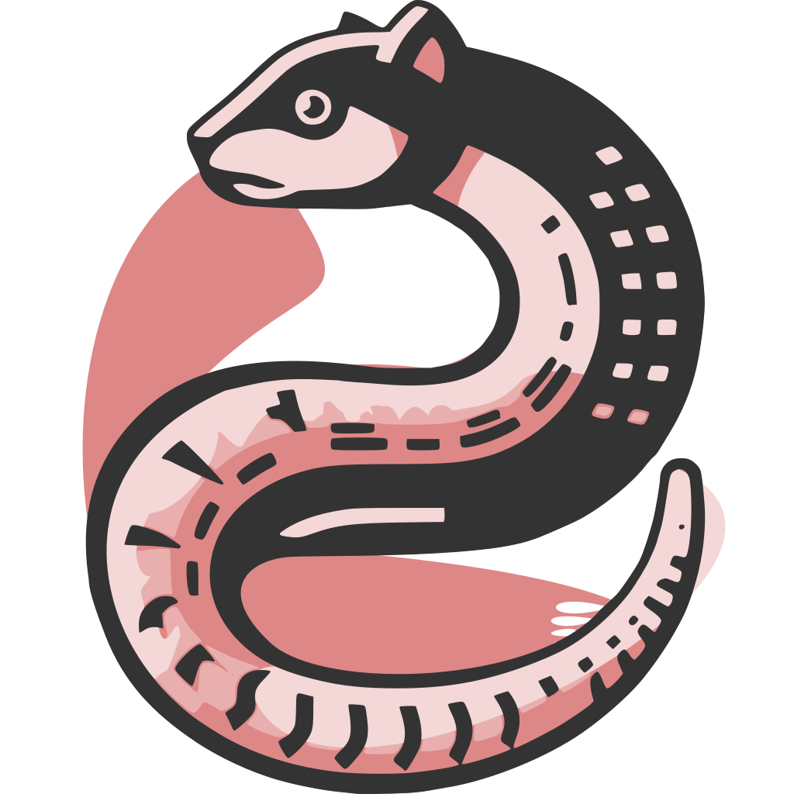

# NumbatUI: source code and graph explorer

:warning: This fork of Sourcetrail is in active development and really unstable, we recommend to not use it before our first releases.



Numbat UI is a fork of [Sourcetrail](https://github.com/CoatiSoftware/Sourcetrail), a source code explorer that was archived in 2021. 

**Why NumbatUI?**
NumbatUI has been written to explore any graph-based data generated by [Numbat](https://quarkslab.github.io/numbat/) (which enables crafting databases through a friendly Python API).
More specifically, NumbatUI has been created to extend Sourcetrail for additional UI/UX features.
Features added are:

* Renaming nodes and edges (to reflect the user specific use-case)
* Custom colors on nodes or edges
* Custom node or edges (tooltips, hovering text)
* file sideloading  (to store file content outside of the database)
* bookmarking all predecsessors or successors of a given node (for later analysis)
* **custom commands** (to perform any user-defined action on nodes/edges, e.g., open a terminal at a given path, open a web page, etc.)


## Usage

We strongly recommend using the provided Docker image to run NumbatUI, as
it contains all the required dependencies. You can either:
- Build locally the docker image:
  ```bash
  cd docker
  docker build -t numbatui .
  ```
- Download it from github:
  ```bash
  docker pull ghcr.io/quarkslab/numbatui:main
  ```

Then open the */path/to/my_database.srctrlprj* database with NumbatUI. The command will depend of your windowing system, as the application is a GUI Qt application
one needs to forward the X11/Wayland display to the container.


- For **X11** users, run the following command. You may need to add allow `docker` to use your Xserver.
> [!NOTE]
> You may need to add allow `docker` to use your Xserver.
> ```bash
> xhost +local:docker
> ```
> After usage, you can remove this authorization with:
> ```bash
> xhost -local:docker
> ```
  ```bash
  docker run -it --rm \
             --env DISPLAY=$DISPLAY \
             --env QT_X11_NO_MITSHM=1 \
             --volume /tmp/.X11-unix:/tmp/.X11-unix \
             --volume /path/to/:/data/ \
             numbatui:latest /data/my_database.srctrlprj
  ```
- For **Wayland** users, run the following command:
  ```bash
  docker run -it --rm \
             --env QT_QPA_PLATFORM=wayland \
             --env XDG_RUNTIME_DIR=$XDG_RUNTIME_DIR \
             --env WAYLAND_DISPLAY=$WAYLAND_DISPLAY \
             --volume /run/user/1000/$WAYLAND_DISPLAY:/run/user/1000/$WAYLAND_DISPLAY \
             --volume /usr/share/wayland-sessions:/usr/share/wayland-sessions \
             --volume /path/to/:/data/ \
             numbatui:latest /data/my_database.srctrlprj
  ```


## Supported Languages

### C

C support is powered by [Clang 11.0.0](https://clang.llvm.org/). For issues loading C code, please have a look at [Clang language compatibility](https://clang.llvm.org/compatibility.html) or report a bug in our [bug tracker](https://github.com/CoatiSoftware/SourcetrailBugTracker).

### C++

C++ support is powered by [Clang 11.0.0](https://clang.llvm.org/). For more Information please visit [Clang C++ Status](https://clang.llvm.org/cxx_status.html). For issues loading C++ code, please have a look at [Clang language compatibility](https://clang.llvm.org/compatibility.html) or report a bug in our [bug tracker](https://github.com/CoatiSoftware/SourcetrailBugTracker).

### Python

Sourcetrail includes support for Python 2 and Python 3 which is powered by our open-source [SourcetrailPythonIndexer](https://github.com/CoatiSoftware/SourcetrailPythonIndexer). If you encounter any issues while using Sourcetrail on a Python project, please let us know by providing a minimal example in our [bug tracker](https://github.com/CoatiSoftware/SourcetrailPythonIndexer/issues).


## Manual Installation
As this fork is currently a WIP, the application should be compiled by
the user. Build instructions are provided for Linux and macOS.

### Requirements

#### Linux (Ubuntu/Debian)
- base tooling: `build-essential`, `cmake`, `git`, `unzip`, `wget`
- LLVM dependencies: `libc++-19-dev`, `liblld-19-dev`, `llvm-19-dev`, `libclang-19-dev`, `clang-19`
- boost: `libboost-filesystem-dev`, `libboost-program-options-dev`,`libboost-system-dev`, `libboost-date-time-dev`
- Qt6: `qt6-svg-dev`, `qt6-base-dev`, `qt6-5compat-dev`

#### macOS (Homebrew)

Tested on Apple Silicon (arm64) with macOS 26 / Tahoe and Homebrew Qt 6.11.

```bash
brew install cmake boost qt@6
# Only needed if you re-enable BUILD_CXX_LANGUAGE_PACKAGE:
# brew install llvm@19
```

### Compilation

From the NumbatUI directory:

```bash
git clone --recurse-submodules https://github.com/Quarkslab/NumbatUI.git
cd NumbatUI

cmake -B build \
      -DCMAKE_BUILD_TYPE="Release" \
      -DBUILD_CXX_LANGUAGE_PACKAGE=OFF \
      -DBUILD_PYTHON_LANGUAGE_PACKAGE=OFF

cmake --build build --target NumbatUI -j $(nproc)
```

On macOS, point CMake at the Homebrew Qt6 install and use `sysctl` for the
parallel job count:

```bash
cmake -B build \
      -DCMAKE_BUILD_TYPE="Release" \
      -DBUILD_CXX_LANGUAGE_PACKAGE=OFF \
      -DBUILD_PYTHON_LANGUAGE_PACKAGE=OFF \
      -DCMAKE_PREFIX_PATH=$(brew --prefix qt@6)

cmake --build build --target NumbatUI -j $(sysctl -n hw.logicalcpu)
```

The compiled binary is available in `build/app/NumbatUI` on Unix
(or `build/Release/app/` on Windows). Launch it directly:

```bash
./build/app/NumbatUI                                # macOS / Linux
./build/app/NumbatUI /path/to/my_database.srctrlprj # open a project
```

The binary is a native arm64 (or x86_64) Mach-O on macOS — no X11 / XQuartz
forwarding required, unlike the Docker image documented above.

Note: This build purposely disables C++, Python language indexation features.
They shall be re-enabled in future releases.

### Debian package (.deb)

On Debian/Ubuntu, NumbatUI can be installed as a native `.deb` package. This
installs the GUI and indexer to `/usr/bin`, the runtime data to
`/usr/share/numbatui`, and registers the desktop entry, MIME association
(`*.srctrlprj`) and application icons.

#### Install a prebuilt package

Every push to the `main` and `dev` branches builds a `.deb` in CI. Download it
from the **Actions** tab: open the latest *Build Debian package* run and grab
the `numbatui-deb-<branch>-<sha>` artifact (tagged `v*` releases also attach the
`.deb` to the GitHub release). Then:

```bash
sudo apt install ./numbatui_*_amd64.deb
```

`apt` pulls in the required Qt 6 and Boost runtime libraries automatically.

#### Build the package yourself

From a checkout of the repository:

```bash
# one-off: install the build dependencies declared in debian/control
sudo apt build-dep .
# or, without a deb-src entry:
#   sudo apt install devscripts equivs && sudo mk-build-deps -i debian/control

# build the binary package (the .deb is written to the parent directory)
dpkg-buildpackage -us -uc -b
ls ../numbatui_*_amd64.deb
```

The packaging lives in `debian/` and drives the same CMake build as above
through `debhelper`. See [`debian/README.source`](./debian/README.source) for
the packaging design and how to bump the package version.

### Note on Docker on macOS

The Docker image documented in [Usage](#usage) is Linux-only and ships a Qt
GUI that talks to X11 / Wayland. Neither display server is native on macOS,
so running it would require installing
[XQuartz](https://www.xquartz.org/) and forwarding `DISPLAY=host.docker.internal:0`
over TCP — workable, but slow and lacking a native look. We recommend the
macOS native build above instead.

## Documentation

For the moment you can consult the old Sourcetrail documentation [here](./DOCUMENTATION.md), we will update it soon.

## Publications
N/A

## Authors
- Eloïse Brocas (@ebrocas), Quarkslab
- Robin David (@RobinDavid), Quarkslab
- Pascal Wu (@pwu42), during his internship at Quarkslab
